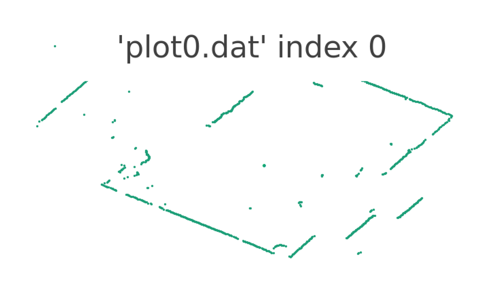

# RPLidar

A small example of using the RPLidar from Slamtec

## Setup

To set up this example, you must first install the [RPLidar SDK](https://github.com/Slamtec/rplidar_sdk).  After this is installed, you must build the sdk separately using make.

```bash

$ cd lib
$ git clone "https://github.com/Slamtec/rplidar_sdk.git"
$ cd rplidar_sdk
$ make

```


Once this library is installed you must install the [sciplot library](https://github.com/sciplot/sciplot).

Run the following:
```bash

$ cd lib
$ git clone "https://github.com/sciplot/sciplot.git"

```

You do not have to build the sciplot library. Note that the sciplot library requires GNUPlot, so if you do not have that installed look [here](https://sourceforge.net/projects/gnuplot/)

## Running

To run the file do:
```bash
$ mkdir build
$ cd build
$ cmake ..
$ ./RPLidar
```

A graph with one full 360-degree lidar scan should appear.
